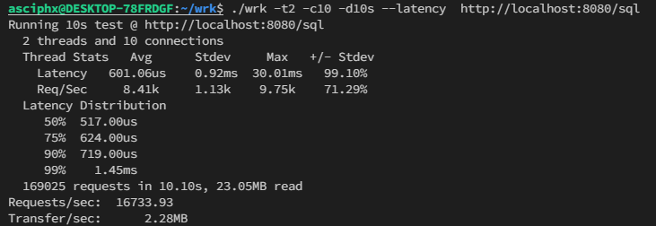

# ccORM[版本 0.5]
ccORM是最好的ORM对象关系映射底层库，采用最哲学最经典极简的设计，低代码和模块化式的开发，友好的用户体验度。
🚀 支持Linux、windows平台(Mac平台暂时未适配字符串类型检测)。开发速度最快、最迅速、最猛烈，即将更新其他功能。
 
```c++
#include "src/json.hpp"
#include "src/ccORM.hh"
auto D =
//D_mysql();
//D_pgsql();
D_sqlite("any.db");
#include "module.hpp"
void test() {
  Tab::ptr t = Tab::create(1, true, "abcd", now(), vector<Type>{ Type{1,"typescript"} });
  t->set(5, false, "yield", now(), vector<Type>{ Type{ 1,"python" }, Type{ 2,"ruby" } }); cout << t << '\n';
  *t = json::parse(u8R"({"id":2,"ok":false,"name":"完美杰作","date":"2021-09-08 01:04:30",
"lang":[{"id":1,"language":"c++"},{"id":2,"language":"lua"},{"id":3,"language":"rust"}]})").get<Tab>();
  t->lang[1].language = "golang"; cout << t << '\n';
  *t = Tab::Q()->select()->field(&Tab::id, &Tab::name)->FindOne("id = 1");
  cout << Tab::Q()->select()->FindArr();
}
int main() {
  InitializationOrm<Type, Tab>(); clock_t start = clock(); test();
  Timer t; bool run = true;
  t.setTimeout([&t, &run] {
	int i = 0; for (; i < 5999; ++i) {
	Tab::Q()->select()->FindOne("id = 2"); } printf("<%d>", i);
	t.stop(); run = false;
	}, 6);
  int i = 0; for (; i < 4999; ++i) {
	Tab::Q()->select()->field(&Tab::id, &Tab::name, &Tab::date, &Tab::ok)->FindOne("id = 1");
  }//模拟双线程以确保SQLite不会出错
  printf("<%d>", i);
  while (run) { this_thread::yield(); }
  printf("\nuse %.6f seconds", (float)(clock() - start) / CLOCKS_PER_SEC);
  std::this_thread::sleep_for(std::chrono::milliseconds(500));//wait for something
  return 0;
}
```

## 特征
 - 模块化
 - 仅头文件
 - 低代码

## 前提
cmake需求：[最好使用vcpkg安装mysql]
find_package(MYSQL REQUIRED)
...然后在需要连接库的位置加入
target_link_libraries(main ${MYSQL_LIBRARY})

或者
下面的方式，这只是示例，注意：必须让mariadb，mariadbclient在最前面，才不会报错
```
g++ -std=c++17 *.cc -o main -I./src -ldl -Wstack-protector -fstack-protector-all
-pthread -ggdb -lmariadb -lmariadbclient -Wwrite-strings -lssl -lcrypto -lz -fPIC 
```
## 即将推出
一对多查询，多对多查询，完善的条件，索引列建立，以及缓存查询

### 归属
    ccORM使用以下库。

    lithium

    https://github.com/matt-42/lithium

	Copyright (c) 2014 Matthieu Garrigues

	Permission is hereby granted, free of charge, to any person obtaining a copy
	of this software and associated documentation files (the "Software"), to deal
	in the Software without restriction, including without limitation the rights
	to use, copy, modify, merge, publish, distribute, sublicense, and/or sell
	copies of the Software, and to permit persons to whom the Software is
	furnished to do so, subject to the following conditions:

	The above copyright notice and this permission notice shall be included in all
	copies or substantial portions of the Software.

	THE SOFTWARE IS PROVIDED "AS IS", WITHOUT WARRANTY OF ANY KIND, EXPRESS OR
	IMPLIED, INCLUDING BUT NOT LIMITED TO THE WARRANTIES OF MERCHANTABILITY,
	FITNESS FOR A PARTICULAR PURPOSE AND NONINFRINGEMENT. IN NO EVENT SHALL THE
	AUTHORS OR COPYRIGHT HOLDERS BE LIABLE FOR ANY CLAIM, DAMAGES OR OTHER
	LIABILITY, WHETHER IN AN ACTION OF CONTRACT, TORT OR OTHERWISE, ARISING FROM,
	OUT OF OR IN CONNECTION WITH THE SOFTWARE OR THE USE OR OTHER DEALINGS IN THE
	SOFTWARE.
