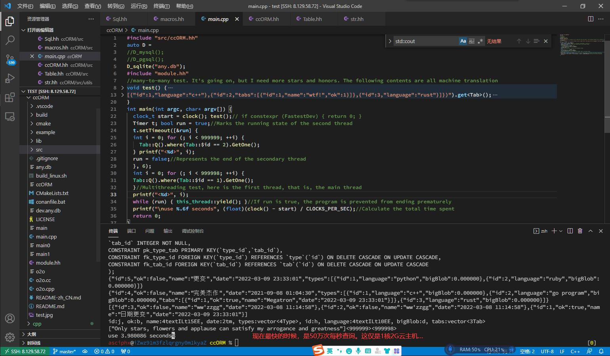

# ccORM[版本 1.5]
> ccORM是最好的ORM对象关系映射底层库，采用最哲学最经典极简的设计，低代码和模块化式的开发，友好的用户体验度。
> 🚀 支持Linux、windows平台(Mac平台暂时未适配字符串类型检测)。性能超越RTTI和protobuf，是编译期的静态反射。

 

## 优势
- [x] 强大静态反射，最高性能，最低开销，最迅速的反应，最容易维护，以及最少代码
- [x] 支持序列化对象或者vector对象到字符串，序列化对象得到JSON，反序列化Json格式字符串到对象
- [x] 允许tm类型，也就是日期类型（以及日期类型的序列化反序列化）
- [x] 容忍多线程高并发，sqlite支持到了双线程，而mysql和pgsql支持完整的cpu线程
- [x] 智能自动建表，模型类与数据库实现深度绑定，是利用宏实现一种类似装饰器功能
- [x] 自动间隔ping数据库的功能，实现数据库不休眠，一直出于唤醒复苏的状态
- [x] 基于oop的增删改查，插入功能还自带返回新增的id
- [x] 超越RTTI以及protobuf，是目前最快最迅速最猛烈的类似于"动态类型c++"的思想理念
- [x] 提供DataMapper，ActiveRecord两种方式进行curd
- [x] 具备编译期类型检测
- [x] VARCHAR数据类型采用text<>
- [x] 原生类型，支持无符号类型[例如:uint8_t,uint16_t,uint32_t,uint64_t]
- [x] 自动创建表，全局初始化，非侵入式
- [x] 增加中间表的构建宏`M_TABLE`
- [x] 新增最快开发者模式，每次都会全部重新建表（注意只能在开发环境下用！）
- [x] 宽松的布尔类型反序列化，包含但不仅限于true、false，还有0，1;
- [x] 序列化以及反序列化支持循环嵌套以及循环依赖还有指针结构体
- [x] 支持一对一的查询，可以像JavaScript那样简洁优雅以及方便

## 即将推出
多对多查询，索引列，唯一键，以及缓存查询等。

## 模型层
```c++
struct Type; D_M_TABLE(Type, Tab)
Struct(Tab) {
  uint32_t id;
  bool ok;
  text<15> name;
  tm date;
  vector<Type> types;
  Tab(uint32_t a = 0, bool b = false, const char* c = "", tm d = now(), vector<Type> e = {}) :
	id(a), ok(b), name(c), date(d), types(e) {}
  FIELD(id, ok, name, date)
};
CONSTRUCT(Tab, id, ok, name, date, types)
PROTO(Tab, id, ok, name, date)
REGIST(Tab,
  TC::PRIMARY_KEY | TC::AUTO_INCREMENT, "",
  TC::DEFAULT, "false",
  TC::DEFAULT, "ww'zzgg",
  TC::DEFAULT | TC::NOT_NULL, "");
Struct(Type) {
  uint8_t id;
  text<10> language;
  double bigBlob;
  vector<Tab> tabs;
  Type(uint8_t a = 0, const char* b = "", double c = 0, vector<Tab> d = {}) :
	id(a), language(b), bigBlob(c), tabs(d) {}
  FIELD(id, language, bigBlob)
};
CONSTRUCT(Type, id, language, bigBlob, tabs)
PROTO(Type, id, language, bigBlob)
REGIST(Type,
  TC::PRIMARY_KEY | TC::AUTO_INCREMENT, "",
  TC::DEFAULT, "c/c++",
  TC::EMPTY, "");
M_TABLE(Type, id, Tab, id)
```
## 主函数
```c++
#include "src/ccORM.hh"
auto D =
//D_mysql();
//D_pgsql();
D_sqlite("any.db");//选择数据库
#include "module.hpp"
void test() {
  Tab::ptr t = Tab::create(1, true, "日期更变", now(), vector<Type>{ Type{ 1,"typescript" } });
  t->Update();//更新
  t->set(5, false, "yield", now(), vector<Type>{ Type{ 1,"python" }, Type{ 2,"ruby" } }); cout << t << '\n';
  *t = json::parse(R"({"id":4,"ok":false,"name":"完美杰作","date":"2021-09-08 01:04:30","types":
[{"id":1,"language":"c++"},{"id":2,"tabs":[{"id":1,"name":"wtf!","ok":1}]},{"id":3,"language":"rust"}]})").get<Tab>();
  t->lang[1].language = "golang"; cout << t << '\n';//宽松布尔类型反序列化，加入0,1的支持
  t->Insert();//插入,返回值是long long类型
  cout << Tab::Q().GetArr();
  t->Delete();//删除
  *t = Tab::Q().where(Tab::$id == 1).GetOne(); cout << t << '\n';
}
int main() {
  clock_t start = clock(); test();
  Timer t; bool run = true;
  t.setTimeout([&run] {
	int i = 0; for (; i < 99999; ++i) {
	Tab::Q().where(Tab::$id == 2).GetOne(); } printf("<%d>", i);
	run = false;
	}, 6);
  int i = 0; for (; i < 98888; ++i) {
	Tab::Q().where(Tab::$id == 1).GetOne();
  }//多线程测试
  printf("<%d>", i);
  while (run) { this_thread::yield(); }
  printf("\nuse %.6f seconds", (float)(clock() - start) / CLOCKS_PER_SEC);
  return 0;
}
```

## 特征
 - 模块化
 - 仅头文件
 - 低代码
 - 高性能

## 前提
cmake需求：[最好使用vcpkg安装依赖包]
```shell
mkdir build
cd build
cmake ..
cmake --build .
```
如果开关变动，请执行需要的开关选项
```
cmake -DFastestDev=OFF -DIsDevMode=OFF --build ./
cmake -DFastestDev=OFF -DIsDevMode=ON --build ./
cmake -DFastestDev=ON -DIsDevMode=ON --build ./
```
然后
```
cmake --build ./
```
或者下面的方式对应上面开关选项，这只是示例，注意：请自行修改`build_linux.sh`文件.通过`sh ./build_linux.sh`编译
```
g++ -DFastestDev=0  -DIsDevMode=0 ...线上环境，不会重新建表
g++ -DFastestDev=0  -DIsDevMode=1 ...不重新建表(未改变表结构可用)，开发环境
g++ -DFastestDev=1  -DIsDevMode=1 ...每次会重新建表，开发环境
```
# 支持的编译器（最低版本）:
    - Linux: G++ 9.2, Clang++ 9.0
    - MacOS: Apple clang version 12.0.0 
    - Windows: MSVC C++ compiler version 1930.

## 普遍命名规则
constexpr -> 小写+大写驼峰分隔，最后一个为大写收尾 => `nameBegiN`  
static 属性 -> `_` 开头，后面全小写+下划线分隔 => `_name_begin`  
static 全局变量 -> `RES_` 开头，后面全大写+下划线分隔 => `RES_NAME_BEGIN`  
private 属性 -> 小写+大写驼峰分隔， `_`收尾 => `nameBegin_`  
public 属性 -> 小写+大写驼峰分隔 => `nameBegin`  
参数 -> 小写+下划线分隔 => `name_begin`  
特殊字段 -> `_` 开头，中间小写+下划线分隔, `_`收尾 => `_name_begin_`  
struct或者class -> 大写开头，后面小写+大写驼峰分隔 => `NameBegin`  
宏 或者static constexpr -> 大写+下划线分隔 => `NAME_BEGIN`  

### 归属
    ccORM使用以下库。

    lithium

    https://github.com/matt-42/lithium

	Copyright (c) 2014 Matthieu Garrigues

	Permission is hereby granted, free of charge, to any person obtaining a copy
	of this software and associated documentation files (the "Software"), to deal
	in the Software without restriction, including without limitation the rights
	to use, copy, modify, merge, publish, distribute, sublicense, and/or sell
	copies of the Software, and to permit persons to whom the Software is
	furnished to do so, subject to the following conditions:

	The above copyright notice and this permission notice shall be included in all
	copies or substantial portions of the Software.

	THE SOFTWARE IS PROVIDED "AS IS", WITHOUT WARRANTY OF ANY KIND, EXPRESS OR
	IMPLIED, INCLUDING BUT NOT LIMITED TO THE WARRANTIES OF MERCHANTABILITY,
	FITNESS FOR A PARTICULAR PURPOSE AND NONINFRINGEMENT. IN NO EVENT SHALL THE
	AUTHORS OR COPYRIGHT HOLDERS BE LIABLE FOR ANY CLAIM, DAMAGES OR OTHER
	LIABILITY, WHETHER IN AN ACTION OF CONTRACT, TORT OR OTHERWISE, ARISING FROM,
	OUT OF OR IN CONNECTION WITH THE SOFTWARE OR THE USE OR OTHER DEALINGS IN THE
	SOFTWARE.


	json 

    https://github.com/nlohmann/json

    Copyright (c) 2013-2021 Niels Lohmann
    Permission is hereby granted, free of charge, to any person obtaining a copy
    of this software and associated documentation files (the "Software"), to deal
    in the Software without restriction, including without limitation the rights
    to use, copy, modify, merge, publish, distribute, sublicense, and/or sell
    copies of the Software, and to permit persons to whom the Software is
    furnished to do so, subject to the following conditions:

    The above copyright notice and this permission notice shall be included in all
    copies or substantial portions of the Software.

    THE SOFTWARE IS PROVIDED "AS IS", WITHOUT WARRANTY OF ANY KIND, EXPRESS OR
    IMPLIED, INCLUDING BUT NOT LIMITED TO THE WARRANTIES OF MERCHANTABILITY,
    FITNESS FOR A PARTICULAR PURPOSE AND NONINFRINGEMENT. IN NO EVENT SHALL THE
    AUTHORS OR COPYRIGHT HOLDERS BE LIABLE FOR ANY CLAIM, DAMAGES OR OTHER
    LIABILITY, WHETHER IN AN ACTION OF CONTRACT, TORT OR OTHERWISE, ARISING FROM,
    OUT OF OR IN CONNECTION WITH THE SOFTWARE OR THE USE OR OTHER DEALINGS IN THE
    SOFTWARE.
