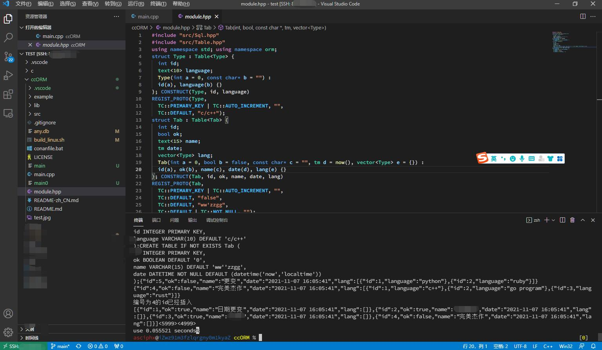

# ccORM[version 0.7]
> ccORM is the best ORM object relational mapping underlying library, which adopts the most philosophical, classic and minimalist design, low code and modular development, and friendly user experience.
> 🚀 Support Linux and Windows Platforms(Mac platform does not adapt string type detection temporarily), performance surpasses RTTI and protobuf and is pure static reflection.

 

 ## Advantage
- [x] powerful static reflection, maximum performance, minimum overhead, the fastest response, the easiest to maintain, and the low code
- [x] supports serializing objects or vector objects to strings, serializing objects to get JSON, and deserializing JSON format strings to objects
- [x] allows TM type, that is, date type (and serialization and deserialization of date type)
- [x] tolerate multithreading and high concurrency. SQLite supports dual threads, while MySQL and PgSQL support complete CPU threads
- [x] intelligent automatic table creation and deep binding between model classes and database is a function similar to decorator realized by macro
- [x] the function of automatically Ping the database at an interval, so that the database does not sleep and is always in the state of wake-up and recovery
- [x] add, delete, modify and query based on OOP. The insertion function also returns the new ID
- [x] surpassing RTTI and protobuf, it is the fastest, fastest and most violent idea similar to "dynamic type C + +"
- [x] you can nest structs with structs, so as to realize one-to-one or one to many, or self nesting, etc
- [x] Provide DataMapper and ActiveRecord for curd
## Model layer
```c++
struct Type : Table<Type> {
  int id;
  string language;
  Type(int a = 0, string b = "") :
	id(a), language(b) {} Type(bool);
}; CONSTRUCT(Type, id, language)
REGIST_PROTO(Type,
  TC::PRIMARY_KEY | TC::AUTO_INCREMENT, "",
  TC::DEFAULT, "c/c++");
struct Tab : Table<Tab> {
  int id;
  bool ok;
  string name;
  tm date;
  vector<Type> lang;
  Tab(int a = 0, bool b = false, string c = "", tm d = now(), vector<Type> e = {}) :
	id(a), ok(b), name(c), date(d), lang(e) {} Tab(bool);
}; CONSTRUCT(Tab, id, ok, name, date, lang)
REGIST_PROTO(Tab,
  TC::PRIMARY_KEY | TC::AUTO_INCREMENT, "",
  TC::DEFAULT, "false",
  TC::DEFAULT, "ww'zzgg",
  TC::DEFAULT | TC::NOT_NULL, "");
```
## Main function
```c++
#include "src/ccORM.hh"
auto D =
//D_mysql();
//D_pgsql();
D_sqlite("any.db");//Select database
#include "module.hpp"
void test() {
  Tab::ptr t = Tab::create(1, true, u8"Date change", now(), vector<Type>{ Type{ 1,"typescript" } });
  t->Update();//update
  t->set(5, false, "yield", now(), vector<Type>{ Type{ 1,"python" }, Type{ 2,"ruby" } }); cout << t << '\n';
  *t = json::parse(u8R"({"id":4,"ok":false,"name":"Flawless masterpiece","date":"2021-09-08 01:04:30",
"lang":[{"id":1,"language":"c++"},{"id":2,"language":"js"},{"id":3,"language":"rust"}]})").get<Tab>();
  t->lang[1].language = "golang"; cout << t << '\n';
  t->Insert();//insert, the return value is long long type
  cout << Tab::Q()->select()->FindArr();
  t->Delete();//delete
  *t = Tab::Q()->select(&Tab::id, &Tab::name)->FindOne("id = 1"); cout << t << '\n';
}
int main() {
  InitializationOrm<Type, Tab>(); clock_t start = clock(); test();
  Timer t; bool run = true;
  t.setTimeout([&run] {
	int i = 0; for (; i < 5999; ++i) {
	Tab::Q()->select()->FindOne("id = 2"); } printf("<%d>", i);
	run = false;
	}, 6);
  int i = 0; for (; i < 4999; ++i) {
	Tab::Q()->select(&Tab::id, &Tab::name, &Tab::date, &Tab::ok)->FindOne("id = 1");
  }//Multithreading test
  printf("<%d>", i);
  while (run) { this_thread::yield(); }
  printf("\nuse %.6f seconds", (float)(clock() - start) / CLOCKS_PER_SEC);
  std::this_thread::sleep_for(std::chrono::milliseconds(500));//wait for something
  return 0;
}
```

## Features
- Modularization
- Header files only
- Low code
- High performance

## Premise
Cmake requirements: [it is best to install MySQL with vcpkg]
find_ package(MYSQL REQUIRED)
...and then add it where you need to connect to the library
target_link_libraries(main ${MYSQL_LIBRARY})
perhaps
This is just an example. Note: please modify the `build_linux.sh` file .Through `sh ./build_linux.sh` compilation
```
g++ -std=c++17 *.cc -o main -I./src -ldl -Wstack-protector -fstack-protector-all
-pthread -ggdb -lmariadb -lmariadbclient -Wwrite-strings -lssl -lcrypto -lz -fPIC 
```
# Supported compilers(minimum version):
    - Linux: G++ 9.2, Clang++ 9.0
    - MacOS: Apple clang version 12.0.0 
    - Windows: MSVC C++ compiler version 1930.

## Coming soon
One to many query, many to many query, perfect conditions, index column establishment, and cache query

### Attributions
    ccORM uses the following libraries.

    lithium

    https://github.com/matt-42/lithium

	Copyright (c) 2014 Matthieu Garrigues

	Permission is hereby granted, free of charge, to any person obtaining a copy
	of this software and associated documentation files (the "Software"), to deal
	in the Software without restriction, including without limitation the rights
	to use, copy, modify, merge, publish, distribute, sublicense, and/or sell
	copies of the Software, and to permit persons to whom the Software is
	furnished to do so, subject to the following conditions:

	The above copyright notice and this permission notice shall be included in all
	copies or substantial portions of the Software.

	THE SOFTWARE IS PROVIDED "AS IS", WITHOUT WARRANTY OF ANY KIND, EXPRESS OR
	IMPLIED, INCLUDING BUT NOT LIMITED TO THE WARRANTIES OF MERCHANTABILITY,
	FITNESS FOR A PARTICULAR PURPOSE AND NONINFRINGEMENT. IN NO EVENT SHALL THE
	AUTHORS OR COPYRIGHT HOLDERS BE LIABLE FOR ANY CLAIM, DAMAGES OR OTHER
	LIABILITY, WHETHER IN AN ACTION OF CONTRACT, TORT OR OTHERWISE, ARISING FROM,
	OUT OF OR IN CONNECTION WITH THE SOFTWARE OR THE USE OR OTHER DEALINGS IN THE
	SOFTWARE.
	

	json 

    https://github.com/nlohmann/json

    Copyright (c) 2013-2021 Niels Lohmann
    Permission is hereby granted, free of charge, to any person obtaining a copy
    of this software and associated documentation files (the "Software"), to deal
    in the Software without restriction, including without limitation the rights
    to use, copy, modify, merge, publish, distribute, sublicense, and/or sell
    copies of the Software, and to permit persons to whom the Software is
    furnished to do so, subject to the following conditions:

    The above copyright notice and this permission notice shall be included in all
    copies or substantial portions of the Software.

    THE SOFTWARE IS PROVIDED "AS IS", WITHOUT WARRANTY OF ANY KIND, EXPRESS OR
    IMPLIED, INCLUDING BUT NOT LIMITED TO THE WARRANTIES OF MERCHANTABILITY,
    FITNESS FOR A PARTICULAR PURPOSE AND NONINFRINGEMENT. IN NO EVENT SHALL THE
    AUTHORS OR COPYRIGHT HOLDERS BE LIABLE FOR ANY CLAIM, DAMAGES OR OTHER
    LIABILITY, WHETHER IN AN ACTION OF CONTRACT, TORT OR OTHERWISE, ARISING FROM,
    OUT OF OR IN CONNECTION WITH THE SOFTWARE OR THE USE OR OTHER DEALINGS IN THE
    SOFTWARE.
